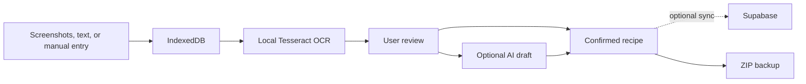

<div align="center">
  
  <h1>PourRecipe</h1>
  <p><strong>An iPhone-first, local-first recipe notebook.</strong></p>
  <p>Capture recipes from screenshots, organize them with on-device OCR, and keep them available offline.</p>
  <p>
    <a href="#getting-started">Getting started</a> ·
    <a href="#privacy-and-data-ownership">Privacy</a>
  </p>
</div>

> [!NOTE]
> This repository does not provide a public hosted instance. Run PourRecipe locally or deploy your own copy. Each deployment uses only the Supabase project and credentials configured by its operator.

## Highlights

- **Local-first by design** — recipes, images, OCR records, categories, tags, cooking logs, conflicts, and pending changes are stored in IndexedDB before any sync occurs.
- **Flexible recipe capture** — start with screenshots, pasted text, manual entry, or a photo.
- **Multi-screenshot import** — import, reorder, review, and process up to 30 screenshots in one recipe.
- **On-device OCR** — Tesseract.js loads only when requested and processes screenshots sequentially to reduce memory pressure on iPhone.
- **Optional AI structuring** — after reviewing OCR text, the user may explicitly ask AI to suggest a title, ingredients, steps, and uncertain content. AI never replaces the original OCR or confirmed recipe content automatically.
- **Unified image management** — manage covers, source screenshots, preparation images, ingredient images, and step images from one compact interface.
- **Offline kitchen tools** — deterministic temperature, weight, volume, length, butter, baking, and China ↔ US recipe conversions work without a network connection.
- **Optional private sync** — Supabase Auth, Postgres with RLS, and private Storage support cross-device synchronization without making local editing dependent on the cloud.
- **Portable backups** — full ZIP export and restore preserves structured data, images, thumbnails, OCR text, and integrity checks.
- **Installable PWA** — designed for Safari “Add to Home Screen,” standalone mode, safe areas, and offline launch.

## How it works



The original screenshots, raw OCR text, edited OCR text, AI draft, and final user-confirmed result remain separate. A failed OCR, AI, or sync request does not remove the local recipe data.

## Getting started

### Requirements

- Node.js
- [pnpm](https://pnpm.io/)

### Run locally

```bash
git clone https://github.com/pour-soi/PourRecipe.git
cd PourRecipe
pnpm install
pnpm dev
```

PourRecipe works in local-only mode without an environment file. Recipes, images, OCR, categories, tags, cooking records, kitchen tools, and ZIP backups remain available.

### Optional Supabase configuration

Copy the placeholder environment file:

```bash
cp .env.example .env.local
```

Then configure only the public frontend values:

```dotenv
VITE_SUPABASE_URL=https://your-project.supabase.co
VITE_SUPABASE_ANON_KEY=your-publishable-or-anon-key
```

Cloning or deploying PourRecipe does not share the maintainer's database. Your deployment connects only to the Supabase project identified by your own environment values.

Apply the versioned migrations from [`supabase/migrations`](./supabase/migrations) and follow [`docs/SUPABASE_SETUP.md`](./docs/SUPABASE_SETUP.md). Never place a Service Role key, database password, or management token in frontend environment variables.

### Optional AI structuring

AI structuring is not required for recipe creation. When enabled:

1. OCR still runs locally in the browser.
2. The user reviews or edits the OCR text.
3. The user explicitly starts “Smart Organize.”
4. Only the confirmed text is sent to the Supabase Edge Function.
5. The Edge Function calls the OpenAI Responses API and returns a structured draft.
6. The user reviews the draft before accepting any changes.

Store `OPENAI_API_KEY` only as a Supabase Edge Function secret. It must never appear in the browser bundle, Git history, logs, or `.env.local` values committed to the repository.

## Development commands

| Command | Purpose |
| --- | --- |
| `pnpm dev` | Start the local development server |
| `pnpm test` | Run the Vitest unit and integration suite |
| `pnpm test:e2e` | Run Playwright end-to-end tests |
| `pnpm build` | Type-check and create the production PWA build |
| `pnpm preview` | Preview the production build locally |

## Privacy and data ownership

- Local OCR sends image pixels only to the in-page Tesseract worker.
- AI requests happen only after an explicit user action and use reviewed text by default.
- The OpenAI API key remains server-side in the Supabase Edge Function.
- Supabase rows are protected by Row Level Security and private images use user-scoped paths.
- Local editing continues when Supabase, OpenAI, or the network is unavailable.
- ZIP backup provides an account-independent copy controlled by the user.
- Clearing browser site data can remove local-only information that has not been synced or exported.

See [`docs/`](./docs) for the local-first model, sync behavior, conflict handling, OCR limitations, kitchen conversion policy, and ZIP backup format.

## Project structure

```text
src/                  React UI, IndexedDB data layer, and browser services
lib/                  Deterministic kitchen and unit conversion logic
supabase/functions/   Optional server-side AI structuring function
supabase/migrations/  Versioned database, RLS, RPC, and Storage policies
tests/                Unit, integration, and Playwright tests
docs/                 Architecture, privacy, backup, OCR, and testing notes
```

## Technology

React · TypeScript · Vite · Dexie · IndexedDB · Tesseract.js · Supabase · Vitest · Playwright · Workbox

---

PourRecipe is under active development. The repository contains source code and configuration placeholders only; it does not include hosted user data, private cloud resources, or secrets.
