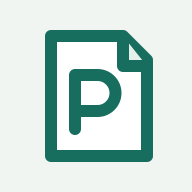
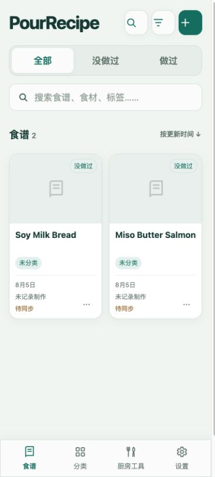
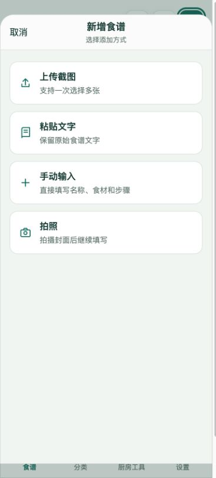
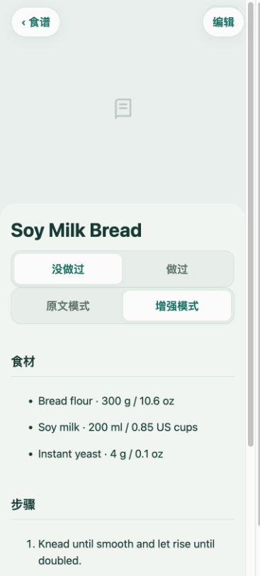
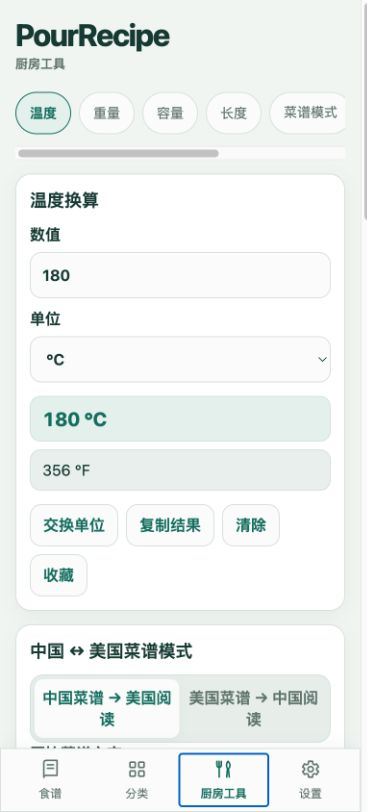
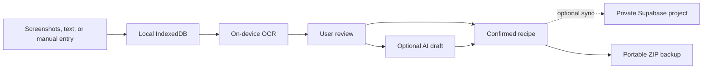

<div align="center">
  
  <h1>PourRecipe</h1>
  <p><strong>A private, local-first recipe notebook designed for iPhone.</strong></p>
  <p>Capture recipes from screenshots or text, review every extraction, cook offline, and sync on your terms.</p>
  <p>
    <a href="#product-tour">Product tour</a> ·
    <a href="#core-capabilities">Capabilities</a> ·
    <a href="#quick-start">Quick start</a> ·
    <a href="#privacy-by-design">Privacy</a>
  </p>
</div>

> [!IMPORTANT]
> PourRecipe has no public hosted instance. Run it locally or deploy your own copy. A deployment connects only to the Supabase project and credentials supplied by its operator—never to the maintainer's recipes or database.

## Product tour

<table>
  <tr>
    <td align="center" width="50%">
      
    </td>
    <td align="center" width="50%">
      
    </td>
  </tr>
  <tr>
    <td align="center"><strong>Personal recipe library</strong><br /><sub>Search, filter, and organize without a commercial food-feed interface.</sub></td>
    <td align="center"><strong>Task-first capture</strong><br /><sub>Start with screenshots, pasted text, manual entry, or a photo.</sub></td>
  </tr>
  <tr>
    <td align="center" width="50%">
      
    </td>
    <td align="center" width="50%">
      
    </td>
  </tr>
  <tr>
    <td align="center"><strong>Reviewable structure</strong><br /><sub>Keep source text separate while refining ingredients and steps.</sub></td>
    <td align="center"><strong>Offline kitchen tools</strong><br /><sub>Read Chinese and US recipes with deterministic unit conversions.</sub></td>
  </tr>
</table>

<p align="center"><sub>All screenshots use synthetic sample recipes created for this repository.</sub></p>

## Core capabilities

| | Capability | What it means |
| --- | --- | --- |
| **Capture** | Multi-screenshot import | Import, reorder, and process up to 30 screenshots while preserving image-to-OCR traceability. |
| **Understand** | Local OCR with optional AI | Tesseract.js runs in the browser. AI structuring runs only when explicitly requested and returns a reviewable draft. |
| **Organize** | Structured recipe library | Manage ingredients, steps, images, categories, tags, cooking records, and best versions. |
| **Cook** | Deterministic kitchen tools | Convert temperature, weight, volume, length, butter, and baking references fully offline. |
| **Preserve** | Local-first storage and ZIP backup | IndexedDB remains the primary store; full ZIP export preserves structured data and images. |
| **Sync** | Optional private Supabase sync | Authentication, Row Level Security, private Storage, conflicts, and tombstones support controlled cross-device use. |

## A review-first workflow



Original screenshots, raw OCR text, edited OCR text, AI drafts, and confirmed recipe content remain separate. OCR, AI, and sync failures do not remove locally stored recipe data.

## Quick start

### Requirements

- Node.js
- [pnpm](https://pnpm.io/)

### Run locally

```bash
git clone https://github.com/pour-soi/PourRecipe.git
cd PourRecipe
pnpm install
pnpm dev
```

No environment file is required for local-only use. Recipe editing, images, OCR, categories, tags, cooking records, kitchen tools, and ZIP backups remain available without Supabase or OpenAI.

<details>
<summary><strong>Configure optional private sync</strong></summary>

Copy the placeholder environment file:

```bash
cp .env.example .env.local
```

Add only the public frontend values from your own Supabase project:

```dotenv
VITE_SUPABASE_URL=https://your-project.supabase.co
VITE_SUPABASE_ANON_KEY=your-publishable-or-anon-key
```

Apply the versioned migrations in [`supabase/migrations`](./supabase/migrations), then follow [`docs/SUPABASE_SETUP.md`](./docs/SUPABASE_SETUP.md). Never expose a Service Role key, database password, or management token to the frontend.

</details>

<details>
<summary><strong>Configure optional AI structuring</strong></summary>

AI structuring is an enhancement, not a requirement:

1. OCR runs locally in the browser.
2. The user reviews or edits the extracted text.
3. The user explicitly starts Smart Organize.
4. The reviewed text is sent to the Supabase Edge Function.
5. The Edge Function calls the OpenAI Responses API and returns a structured draft.
6. Nothing changes in the recipe until the user accepts the draft.

Store `OPENAI_API_KEY` only as a Supabase Edge Function secret. It must never appear in browser code, committed environment files, or client logs.

</details>

## Privacy by design

| Boundary | Guarantee |
| --- | --- |
| **Local data** | Recipes and pending changes are written to IndexedDB first. Clearing browser site data can remove information that has not been synced or exported. |
| **OCR** | Screenshot pixels are processed by the in-page Tesseract worker; local OCR does not require uploading the image. |
| **AI** | Requests require an explicit action and send reviewed text by default. The OpenAI API key stays in the Edge Function. |
| **Cloud sync** | Sync is optional. RLS protects database rows and private Storage uses user-scoped paths. |
| **Backups** | ZIP export creates an account-independent copy controlled by the user. |
| **This repository** | Source code, migrations, and placeholders are public. User recipes, cloud resources, credentials, and the maintainer's hosted site are not included. |

## Development

| Command | Purpose |
| --- | --- |
| `pnpm dev` | Start the local development server |
| `pnpm test` | Run the Vitest unit and integration suite |
| `pnpm test:e2e` | Run Playwright end-to-end tests |
| `pnpm build` | Type-check and create the production PWA build |
| `pnpm preview` | Preview the production build locally |

### Project structure

```text
src/                  React UI, IndexedDB data layer, and browser services
lib/                  Deterministic kitchen and unit conversion logic
supabase/functions/   Optional server-side AI structuring function
supabase/migrations/  Versioned database, RLS, RPC, and Storage policies
tests/                Unit, integration, and Playwright tests
docs/                 Architecture, privacy, backup, OCR, and testing notes
```

**Technology:** React · TypeScript · Vite · Dexie · IndexedDB · Tesseract.js · Supabase · Vitest · Playwright · Workbox

---

PourRecipe is under active development. Review the documentation and security settings before operating a public deployment.
